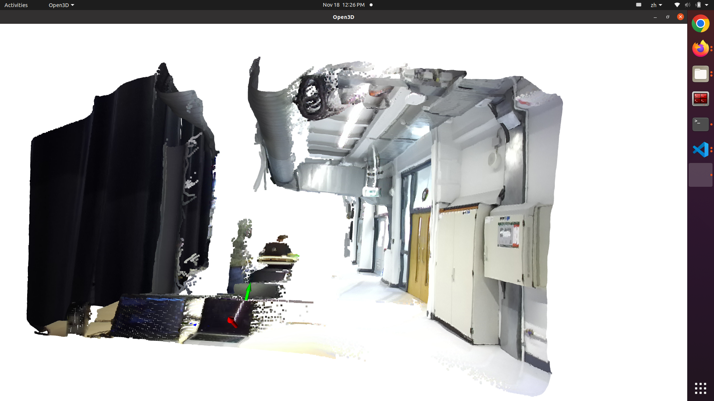
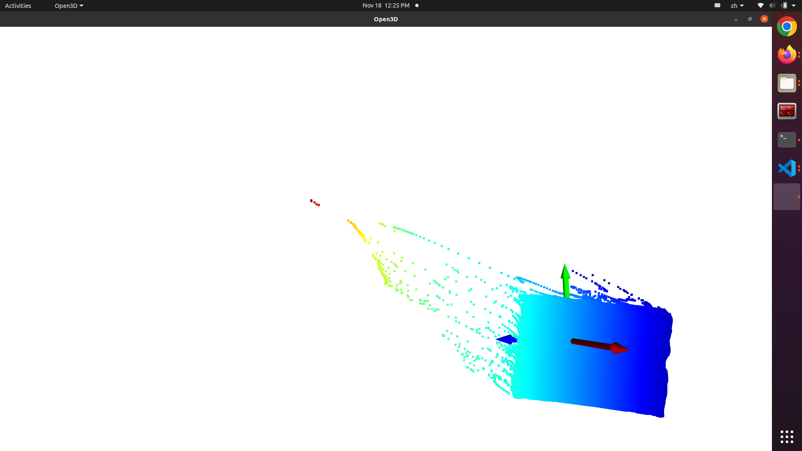

# gcasp-for-zed-camera

This is an implementation of [gcasp](https://github.com/zju3dv/gcasp) for ZED camera. The code is tested on Ubuntu 20.04 with ZED 2i camera.

## Installation
* Follow the instructions from openmmlab to install [mmdetection](https://mmdetection.readthedocs.io/en/latest/get_started.html).
* Other dependencies:
```bash
pip install scikit-image
```

## Inference
* Download the pretrained checkpoint for gcasp from [here](https://drive.google.com/file/d/1Voz-_p0X9cFmNey-yRbnkV6hsVYmDVzZ/view)
* Download the pretrained checkpoint for instance segmentation. Modify the path for config file and checkpoint file in the `pose_inference.py` around line 45. My implementation uses `rtmdet-ins_x_8xb16-300e_coco`. You can download the checkpoint from [here](https://download.openmmlab.com/mmdetection/v3.0/rtmdet/rtmdet-ins_x_8xb16-300e_coco/rtmdet-ins_x_8xb16-300e_coco_20221124_111313-33d4595b.pth)
* Then run the following command:
```bash
python pose_inference.py /home/lxt/research-assignment/gcasp/config/gcn3d_seg/gcn3d_seg_all_256.yaml --pretrained ./epoch_29_iters_581280.pth
```
* The output should look like this:



